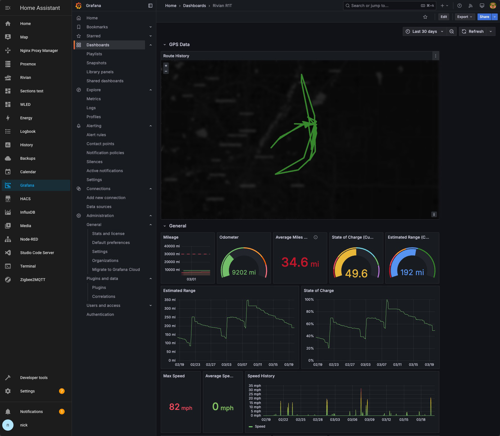
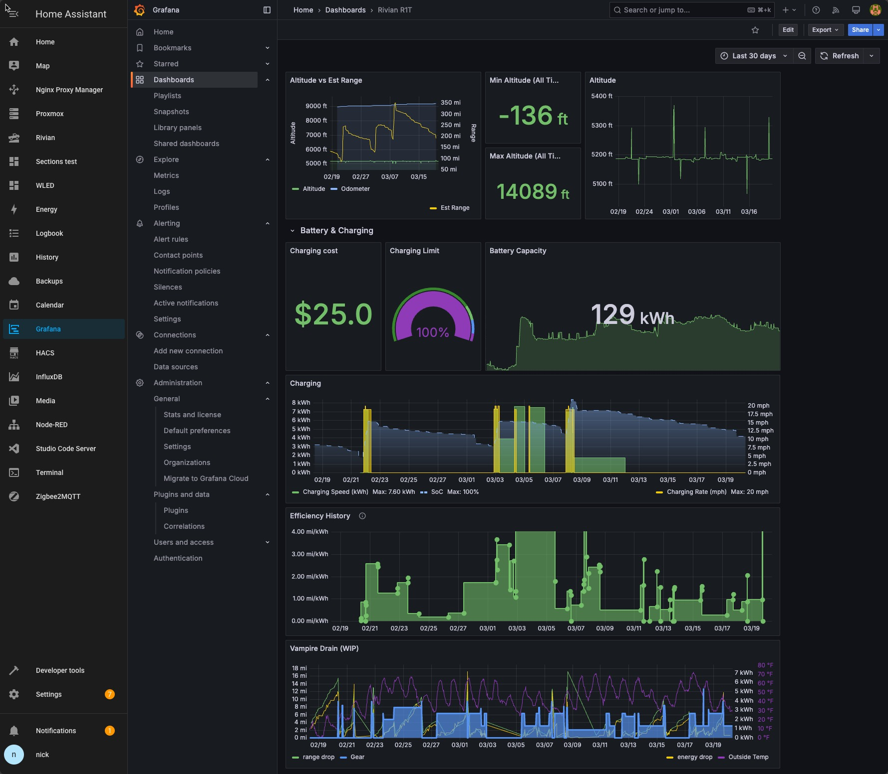

# Rivian Dashboard for Grafana

This dashboard is designed to track multiple stats for your Rivian. It uses InfluxDB as the data source and is designed to be used with the Rivian custom integration for Home Assistant. You will likely need to update the queries to point to your InfluxDB database and the sensor names to match your Home Assistant, so this is really just a template for how you can set this up and what is possible.

Some of the included panels pull stats from custom sensors, which you can find in either the `yaml/sensors/` directory or the `packages` directory. The custom sensors are used to calculate stats like vampire drain, efficiency, and more.

## Why use Grafana instead of Home Assistant dashboards?

By default, Home Assistant purges historical data every so often to keep the database size manageable. This means that you can't easily track historical data over long periods of time. It can be configured, but grows very quickly and can slow down your Home Assistant, or even crash it. InfluxDB on the other hand stores data much more efficiently, and can handle storing vast amounts of data for long periods of time without any impact on the performance of Home Assistant. Grafana is just the front end that allows you to visualize that data in a way that is much more powerful and flexible than the built-in Home Assistant dashboards. Panels from can be shared and embedded into your Home Assistant dashboards as well, so you can have the best of both worlds!

## Things you'll need to do to implement this dashboard:

First off, this was created on a system that's running InfluxDB adn Grafan as Home Assistant add-on's. You'll need to either do the same, or setup InfluxDB and/or Grafana on another system, and confirm they are able to talk to each other. 

Once you have the dashboard json copied to a new dashboard in Grafana, you'll need to check the queries, to ensure that the entity_id's match your Home Assistant setup. You'll also need to ensure that the InfluxDB database name is correct.

The panel that calculates miles per day is currently setup to divide the change in Odometer value by the amount of time that has passed since June 27, 2024 (the day I took delivery of **my** Rivian). To update this, use an epoch time converter, like [epochconverter.com](https://epochconverter.com "Epoch Converter"), to find the epoch time of the day you took delivery of your Rivian, and update the query accordingly.

## Screenshots

 
 
